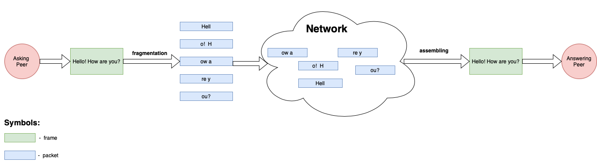

# Introduction

In this tutorial, we will create our very own Membrane Framework consisting of our custom which will fulfill the multimedia processing task.
Despite the fact that the multimedia processing task we will be facing will be really simple, we will need to deal with some problems occurring in real-life scenarios.
At the same time, we will make ourselves comfortable with some concepts of multimedia streaming as well as get in touch with the nomenclature used in this field.
Prepare for an adventure!

## Environment preparation

In order to be able to proceed with the tutorial, you need to have Elixir installed: [How to install Elixir](https://elixir-lang.org/install.html).
We assume, that you are at least slightly familiar with that language - if that is not true, we would like to strongly encourage you to take a look at the [official Elixir tutorial](https://elixir-lang.org/getting-started/introduction.html).
Once you are ready with the Elixir, you can get the project template we have prepared for you:

```
git clone https:/github.com/membraneframework/membrane_basic_pipeline_tutorial
cd membrane_basic_pipeline_tutorial
git checkout template/start
mix deps.get
```

As you can see, the template's code is put on the `template/start` branch of the repository.
In the repository, there is also a `template/end` branch, where you can find the completed template.
If you find yourself lost during the tutorial feel free to check the implementation proposed by us, put on this branch.

## Use Case

Imagine that there is a conversation occurring between two peers and the chat is based on a question-answer scheme.
Each of the peers sends its part of the conversation (that means - the first peer sends questions and the second peers sends the answers to them). We refer to each sentence sent by the peers as a **frame**.
However, due to network limitations each frame sent by the peers is fragmented since only a few chars can be sent at the same time - that means, a single frame is sent as a sequence of **packets**.
In a real network there is a parameter called MTU (*Maximum Transmission Unit*) which is the maximum number of bytes which can be send in a single packet. For the Ethernet II MTU is equal to 1500 bytes. We wanted to simulate the situation,
in which the data needs to be fragmented in order to be transmitted - but we decided to choose a small MTU so that this fragmentation is easy to be spotted.
Each packet consists of the *header* (describing where the particular bunch of characters it transports should be put) and the *body* - aforementioned  bunch of characters.
Below you can see an exemplary frame sent by one peer to the other. It gets fragmented into multiple packets, which later on are sent via the network (during that process their order will probably get messed). On the second peer's side, the packets get assembled into the original frame.


### Packet format

Here is how each packet looks like:

```
[seq:<sequence_id>][frameid:<frame_id>][timestamp:<timestamp>]<text>
```

where:

- sequence_id - the ordering number of the packet (relative to each of the peers). It reflects the position of a particular packet in the packets' stream.
- frame_id - the identifier which consists of the number of the frame to which the body of a given packet belongs, optionally followed by a single **'e'** character (meaning that the packet is the **e**nding packet of the frame). Note that frames are numbered relatively to each peer in that conversation and that frame_id does not describe the global order of the frames in the final file.
- timestamp - a number indicating a time at which a given sentence was said. Timestamp describes the order of the frames from both peers.
- text - the proper body of the packet, in our case - a bunch of characters which could be sent in a single packet.

### Packets generator

We have equipped you with the tool which produces the packets in the format described previously, based on the input conversation. You can use it as a mix task, by typing:

```
mix generate_input --packetsPerFrame <packets_per_frame> <input_file_path>
```

where:

- *input_file_path* is a path to the file which contains the text of the conversation. The input file consists of multiple lines of the following format:

```
<speaker id>: <text>
```

- *packets_per_frame* is a number of packets on which each frame will be dismantled

Based on the input file content, that command will create multiple files, `<input_file_path>.<speaker id>.<input file format>` . For instance: `input.txt` with input from speakers `A` and `B` will be split into `input.A.txt` and `input.B.txt` files.
The first file will contain the shuffled list of packets made from the `A` speaker's lines from the input file and the second file will contain a shuffled list of packets made out of the `B` speaker's lines of the input file. That `shuffle` is a way to simulate the imperfectness of the network - in real-life scenario, the order in which the packets are received is not always the same as the order in which they were sent. [Here](https://www.openmymind.net/How-Unreliable-Is-UDP/) you can read about this phenomenon occurring while using UDP.
Below you can see the steps which are taken during the input files generation:<br>

Create a file with your own input conversation occurring between two speakers or use the `input.txt` file where we have provided you such a conversation. Generate the files containing packets, with the use of `mix generate_input` task.

## Task description

By the end of this chapter you should have generated the files containing packets (i.e. `input.A.txt` and `input.B.txt`).

Your task is to assemble the conversation together from those packets. In the first step you will reproduce the sentences sent by each of the peers by gathering the words sent in packets in the appropriate order. In multimedia processing, we would say that you need to reproduce the *frame* out of the *transport layer packets*. Later on you need to put those *frames* in the correct order, producing the *raw data stream*.
The resulting file should be the same as the input file from which you have created two packets list with the use of the `InputFilesGenerator`.
