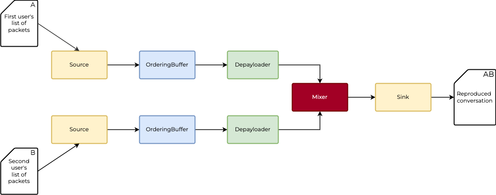
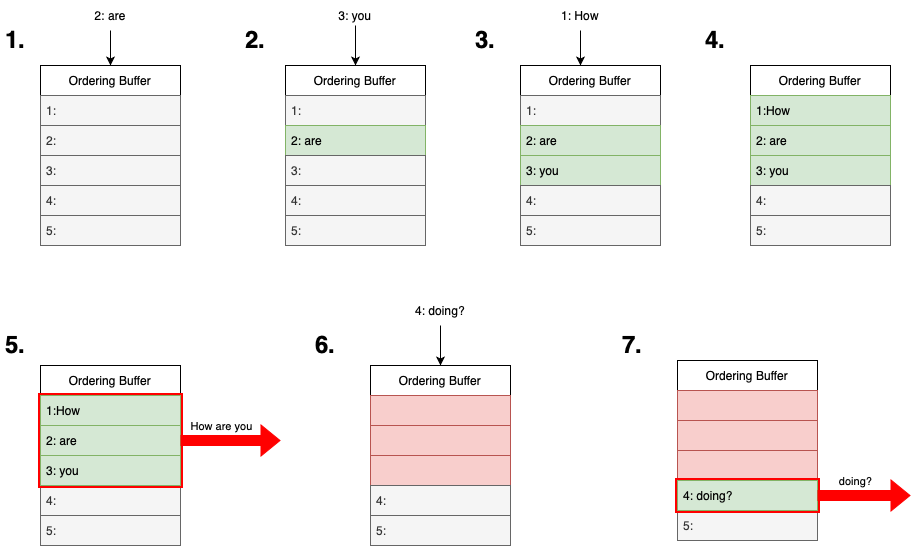

# System Architecture

Once we know what should be done, let's start thinking how should our system look like!

First, let's get familiar with some terms. In the Membrane Framework, there is a concept of the [`pipeline`](../glossary/glossary.md#pipeline) which consists of multiple [`elements`](../glossary/glossary.md/#element). Elements are linked with the use of the [`pads`](../glossary/glossary.md#pad), which can be input pads or output pads.
Depending on what type of pads the particular element is equipped with, we distinguish the following types of elements:

- Source - element with only output pads, the first element of each pipeline. It is responsible for fetching the data and transmitting it through the output pad.
- Filter - element with both the input pads and the output pads. Its purpose is to get the data via the input pad, transform it and finally transmit the processed data via the output pad.
- Sink - element with only input pads, the last element of the pipeline. It can be responsible for storing or playing the data received via the input pad.
  Between the pads, the [`buffers`](../glossary/glossary.md#buffer) are being sent.
  Buffers sent between the pads should be of the same type. In the Membrane Framework nomenclature, we say, that the pads should have corresponding capabilities - [`caps`](../glossary/glossary.md#caps).
  One might wonder when does the event of the buffers being sent occurs - well, it depends on the pad's mode!
  If the pad works in the *pull* mode, the buffer is sent when it is demanded by the succeeding element in the pipeline.
  Otherwise, the pad works in the *push* mode, which means that it is pushing the buffers once they are ready, independently from the fact if the following elements want (and are capable of processing) it.
  In our pipeline, all the pads will work in the *pull* mode, which inducts a flow control by a [backpressure](https://medium.com/@jayphelps/backpressure-explained-the-flow-of-data-through-software-2350b3e77ce7) mechanism.

## Scheme

  
As you can see, our pipeline will consist of two twin branches, one per each of the peers. The branches will be merged with the `Mixer` element and the result produced by this element will be put in the file with the `Sink` elements.
Here you can find the description of the particular elements of the system.

## Elements description

- **Source** - that element is responsible for reading the list of [packets](../glossary/glossary.md#packet) from the file.
- **Ordering Buffer** - this element is responsible for reordering the packets based on their sequence id. The most important part of this element is the buffer, within which there is a place for all the packets, identified by the packet's sequence id. Once the new packet is received, it is placed in the proper place in the buffer, depending on the sequence id. If there is a consistent part of packets "at the bottom of the buffer" (which means - packets with the subsequent sequence ids, which haven't already been sent yet), then this part is sent via the output pad. That is how we make sure that the next element will receive elements sorted by the sequence id.
  Below you can see how the Ordering Buffer is expected to work, once the message "How are you doing?" will be sent in the four packets, each with one word, and received in the following order: (are, you, how, doing?)  
    
- **Depayloader** - responsible for assembling the packets into the [frames](../glossary/glossary.md#frame). Since the depayloader receives the packets in the order of their sequence id (which means - the order in which they were 'sent'), it is capable of separating out the particular frames, basing on the **e** (ending packet of the frame) characters at the end of the frame id. This element also reads the timestamp from the packets' headers and puts it into buffer's 'pts' (*Presentation timestamp*) field.
- **Mixer** - responsible for mixing the frames received via two input pads. The order in which the frames are mixed is based on their 'pts' (*Presentation timestamp*).
- **Sink** - this element is responsible for writing the received frames to the file. Since the Mixer takes care of sorting the frames based on the timestamp, Sink can take advantage of the fact that the frames will be ordered and write them to the file in the order they are received.

Now, that you have some high-level understanding of the system we can get down to implementation.
