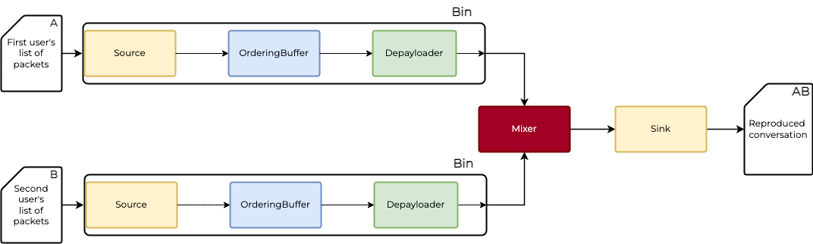

# Bin

A Membrane's bin is a container for [elements](../glossary/glossary.md#element), which allows for creating reusable groups of elements.
Bin is similar to a [pipeline](../glossary/glossary.md#pipeline) in that it consists of linked elements. Such bin can then be placed inside a pipeline and linked with other entities - elements or bins. Bins can also be nested within one another.
Bin also has another advantage - it manages its children, for instance by dynamically spawning or replacing them as the stream changes.

## Enclosing pipeline elements inside a bin

As you can see, we have [`Source`](../glossary/glossary.md#source) -> [`Ordering Buffer`](../glossary/glossary.md#jitter-buffer--ordering-buffer) -> [`Depayloader`](../glossary/glossary.md#payloader-and-depayloader) chain, which is duplicated.
 <br>

We can encapsulate these elements inside `Bin`.
 <br>

Notice that there is no direct connection between `Depayloader` and [`Mixer`](../glossary/glossary.md#mixer). We have to explicitly link the `Depayloader` with `Bin`'s output [pads](../glossary/glossary.md#pad) and then we will connect the output pads to `Mixer`'s input pads.

Let's define the bin's output pads and its elements.

**_`lib/Bin.ex`_**

```elixir
defmodule Basic.Bin do
  use Membrane.Bin

  def_output_pad :output, accepted_format: %Basic.Formats.Frame{encoding: :utf8}

  def_options input_filename: [
              type: :string,
              description: "Input file for conversation."
            ]

  @impl true
  def handle_init(_ctx, options) do
    spec = [
      child(:input, %Basic.Elements.Source{location: options.input_filename})
      |> child(:ordering_buffer, Basic.Elements.OrderingBuffer)
      |> child(:depayloader, %Basic.Elements.Depayloader{packets_per_frame: 4}) 
      |> bin_output(:output)
    ]

    {[spec: spec] %{} }
  end
end
```

The output pads of the bin are matching the ones we [defined for depayloader](/basic_pipeline/08_Depayloader.md#libelementsdepayloaderex-2).
Notice that the last link is between `depayloader` and the bin's output pads. In general, if we wanted to receive data in a bin we would need to link the first processing component in the bin with the `bin_input(<bin's input pad name>)`.

## Modifying pipeline using bin

Using the bin we created, we can replace the elements in the pipeline.

**_`lib/Pipeline.ex`_**


```elixir
defmodule Basic.Pipeline do
  @moduledoc """
  A module providing the pipeline, which aggregates and links the elements.
  """
  use Membrane.Pipeline

  @impl true
  def handle_init(_ctx, _opts) do
    spec = [
      child(:bin1, %Basic.Bin{input_filename: "input.A.txt"}) 
      |> via_in(:first_input)
      |> child(:mixer, Basic.Elements.Mixer),
      child(:bin2, %Basic.Bin{input_filename: "input.B.txt"}) 
      |> via_in(:second_input) 
      |> get_child(:mixer),
      get_child(:mixer) 
      |> child(:output, %Basic.Elements.Sink{location: "output.txt"})
    ]

    {[spec: spec], %{}}
  end
end
```

Combining the usage of the bin and [dynamic pads](13_DynamicPads.md) will result in an even cleaner and more scalable solution.
