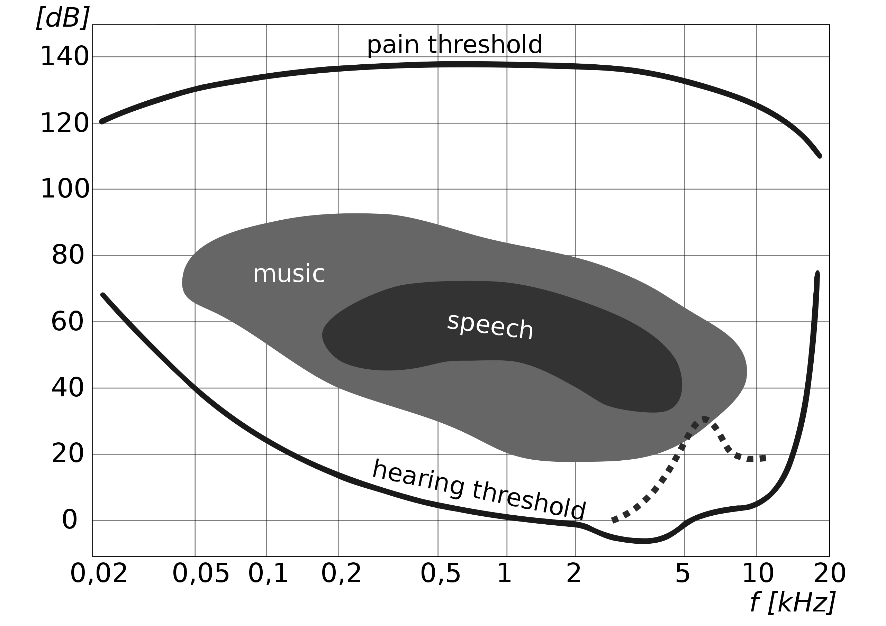
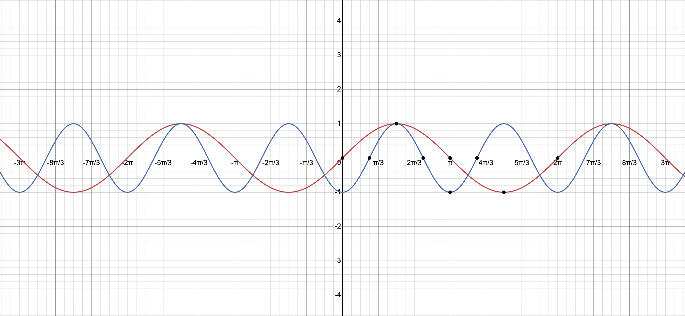
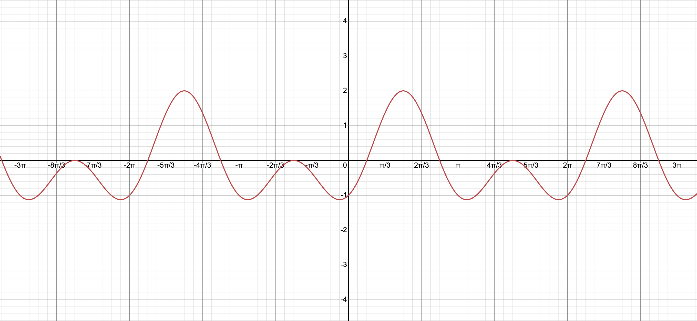
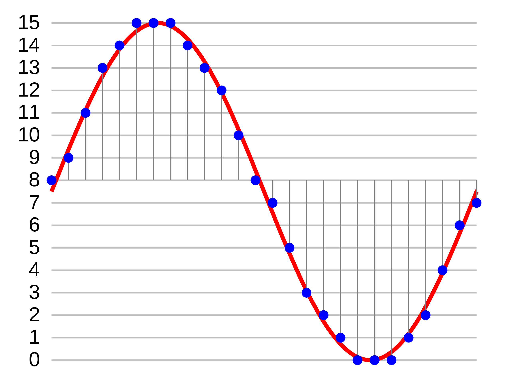
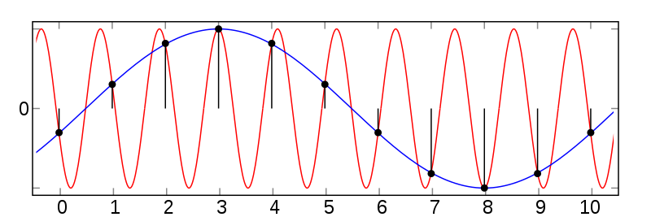
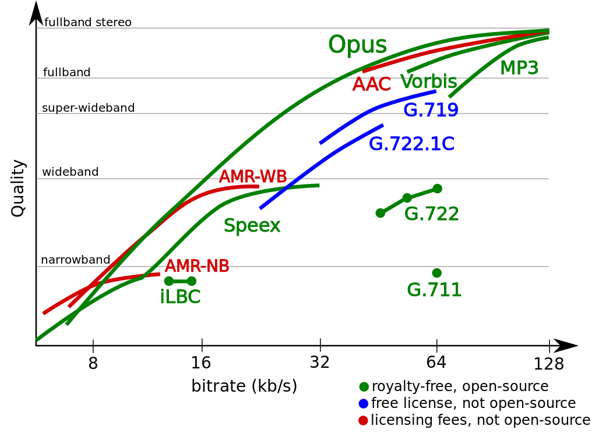

# Audio processing

## Physics and humans

Sound propagates through the air in the form of waves of alternating high and low pressure.

Here's an animation of air particles wiggling around


#### A greater difference between the highest and the lowest pressure in the wave makes the sound louder

We describe loudness using the decibel scale where 0dB denotes near-silence - a vibration that is at the edge of human perception. Every increment of 10 on the decibel scale denotes a 10x more powerful vibration.

Amplitude changes with the square root of power so while a 10dB difference produces 10x the power it produces only 3.162x the amplitude.

Here's a handy table:

| dB | Power ratio | Amplitude ratio |
|----:|:------------:|:---------------:|
| 100 | 10000000000 | 100000 |
| 90 | 1000000000 | 31623 |
| 80 | 100000000 | 10000 |
| 70 | 10000000 | 3162 |
| 60 | 1000000 | 1000 |
| 50 | 100000 | 316.2 |
| 40 | 10000 | 100 |
| 30 | 1000 | 31.62 |
| 20 | 100 | 10 |
| 10 | 10 | 3.162 |

 The loudest possible sound on earth is about 191dB which corresponds to a pressure variation of 1 atmosphere. Going higher produces shockwaves :D

#### A higher frequency vibration corresponds to sound with a higher pitch

Humans perceive sounds in the range of 16Hz - 21kHz. 



In modern times the frequency of 440Hz corresponding to the tone A was chosen as the reference point for music. An octave consists of 12 half-tones evenly spaced on a logarithmic scale such that going up one octave corresponds to a doubling of the soundwave frequency. 

Here are two waves - one with double the frequency of the other one



As such waves constructively interfere, we perceive consonance between the same tones in different octaves.



## Recording 🎙 and playing 🔊 sounds 

Microphones record sounds by measuring the deflection of a membrane perturbed by the acoustic vibrations of the air. Louder sounds make it deflect more, higher frequencies make it deflect more often.

If we then use the recorded signal to recreate the movements of a membrane we produce the same vibrations in the air thus playing back the recorded sound. This can be achieved by driving the diaphragm of a speaker with an electromagnet.

To store a continuous soundwave in memory we need to sample it i.e. store just a finite amount of equally spaced measurements. Rounding the measurement to the nearest allowed value is called quantization.

Representing raw sounds in this way is called Pulse Code Modulation (PCM) and here's what it looks like


Notice that to capture a sound with a given frequency we need a sampling rate that's at least double that frequency to account for both the peaks and the throughs in the wave.

(It's actually more complicated and involves some [math](https://en.wikipedia.org/wiki/Nyquist%E2%80%93Shannon_sampling_theorem))

As most human speech is below 4kHz an `8kHz` sampling rate is usually used to register it (that is the case, for instance, in GSM). `44.1kHz` or `48kHz` is used for standard quality audio as this is sufficient to cover the human hearing range and `96kHz` is used for high-quality audio.

When it comes to sampling, a problem called 'aliasing' occurs. 
Imagine, that you are about to sample with `f_s` frequency. If so, you cannot distinguish between the harmonic signal of frequency `f_0` from the signal of frequency (`f_0+k*f_s`), where k is a integer.
Such a situation is shown on the picture below:


While sampling in points marked as black dots, we can interpolate both the blue (the original harmonic wave) and the red (so called "alias") sin-waves through these points.
As you can see, aliasing introduces some additional harmonic waves to our description of sound, with frequencies higher then the original ones.
That is why signals must be low-pass filtered before sampling to avoid that problem. While an ideal low-pass filter would perfectly pass frequencies below 20 kHz (without attenuating them) and perfectly cut off frequencies above 20 kHz, such an ideal filter is theoretically and practically impossible to implement as it is noncausal, so in practice, a transition band is necessary, where frequencies are partly attenuated. The wider this transition band is, the easier and more economical it is to make an anti-aliasing filter. The 44.1 kHz sampling frequency allows for a 2.05 kHz transition band.
Below you can find out more about the nature of aliasing:
https://www.youtube.com/watch?v=--P0ZsbzJSw

## Raw audio and terminology

As each sample represents the sound level, it is stored as a number. Depending on the needed audio quality, it can be an 8 to 32-bit integer. The number of bits dedicated to each sample is called `bit depth`.

Sometimes, audio is stored in 32 or 64-bit floats, ranging from 0 to 1. That way we can achieve better accuracy for silent sounds, at the cost of loud ones. Samples can be stored as big or little-endian and signed or unsigned numbers. The sample format is often described with the use of the following syntax:
```
<s|u|f><8..64><le|be>
```
which expands to
```
<signed|unsigned|float><8..64 bit><little|big endian>
```

For example, `s16le` would mean signed, 16-bit, little-endian integer.

Both the sample rate and sample format of audio can be changed, though that may involve resampling or dithering, respectively.

The audio stream can also have multiple channels - a phone call would usually have a single one, stereo recording will have two, while a surround sound may have five or more of them. Each channel means another, separate sound wave, so we need to store multiple sequences of samples. Samples of each channel may be stored either in an interleaved or planar format. The interleaved format assumes storing corresponding samples from all channels together, for example
```
ABCDABCDABCDABCD...
```
while in planar format samples from each channel are stored in large chunks, possibly covering the entire stream:
```
AAAAAAAAAAA... BBBBBBBBBBBB... CCCCCCCCCCCC... DDDDDDDDDDDDDD...
```
To sum up, raw audio is stored as a sequence of samples and can have different
- sample rate
- sample format
- the number of channels

`Bit rate` refers to the number of bits per second that the track occupies.

```
bit rate = sample rate × bit depth × channels
```

For a 48kHz s16le stereo track that would be:

```
48.000 x 16 x 2 = 1.536.000 bps ~= 1.5 Mbps
```

## Codecs overview

The goal of audio codecs is to compress the raw audio data so that it has a lower memory footprint. The techniques used to achieve this will be covered in chapters describing the various codecs but in general, the most common techniques are called [modified discrete cosine transform](https://en.wikipedia.org/wiki/Modified_discrete_cosine_transform) (MDCT) and [linear predictive coding](https://en.wikipedia.org/wiki/Linear_predictive_coding) (LPC).

`MP3` is the most commonly known lossy audio codec. By now its patents expired and both encoders and players can use it royalty-free. However, it doesn't achieve state-of-the-art performance anymore - there are better options available.


The `AAC` codec was designed to replace MP3 and achieves better performance. Distributing AAC-encoded content requires no fees but a patent license is required for developers of AAC encoders (this is one of the reasons why FFmpeg is available only in source form). It is used universally in the Apple ecosystem and it is still the primary audio codec used to encode audio in MP4 files, although MP4 now supports a range of other codecs as well.

`FLAC` is the most popular lossless audio codec. Lossless encoding comes at a significant cost though and FLAC files are routinely several times bigger than their lossy peers. The increased quality is generally imperceptible to most non-musicians.

At the time of writing `Opus` is the best audio codec around. It is the successor to the `Vorbis` codec and it achieves significantly better performance than MP3 and Vorbis and slightly outperforms AAC. Notably, it achieves good performance across a very wide range of bitrates thus making it suitable for encoding both speech and music. It is available royalty-free.

Opus achieves a good performance in a wide range of applications because the codec recognizes what type of audio it is encoding and chooses the best algorithm for the job. The LPC-based `SILK` algorithm (developed by Skype) is used to encode speech while the MDCT-based `CELT` algorithm is better suited for music. Opus can freely switch between them or combine them. The `Speex` codec based on the `CELP` speech-coding algorithm is now considered obsolete in favor of the newer SILK-based Opus standard.

Here's a comparison of coding efficiencies for the most popular audio codecs (full band means that it covers the entire human hearing range)


*Note that the source for this image is www.opus-codec.org/comparison/ so it may be somewhat biased*

