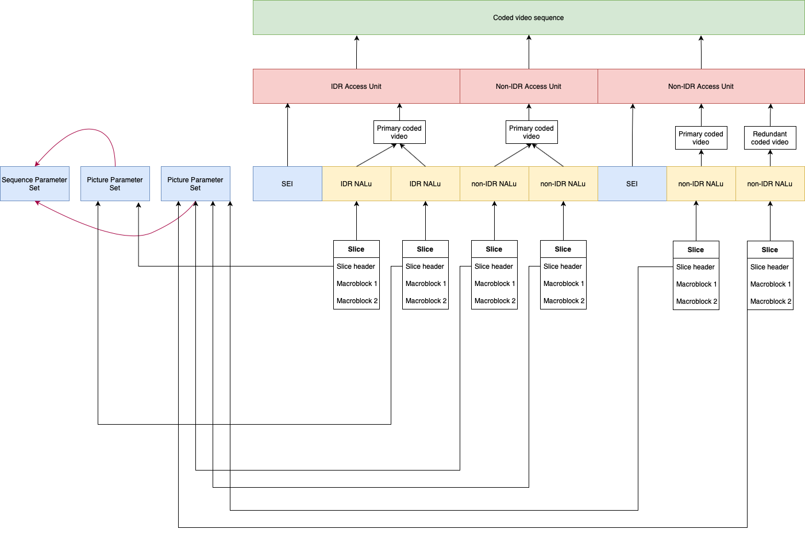

In this chapter you will learn about the H264 codec and how its processing is done with the Membrane Framework plugin - the [H264 plugin](https://github.com/membraneframework/membrane_h264_ffmpeg_plugin).

In H264 we can distinguish two layers of abstraction - the video coding layer (VCL), focused on the visual representation of the video, and the network abstraction layer (NAL), focused on how to structurize the stream so that it can be sent via the network.

When it comes to VCL, a video encoded with the H264 codec is represented as a sequence of pictures. Each picture consists of many **macroblocks**.
The macroblock is simply a part of the picture (in the context of some spatial dependence) - i.e. the top left corner of the picture.
The macroblocks are grouped together into so-called **slices**. Each slice consists of some macroblocks, which share the same **slice header**, containing some metadata common for all these macroblocks.

Each slice (which in fact is a part of a video picture), can be packed into a single
**NALu** (*Network Abstraction Layer units*). As the name suggests, here is where we start to deal with NAL. NALu is just an atomic piece of information sent through the network - it might contain some visual data (i.e. a list of macroblocks forming a part of a video frame), but it is not limited to the visual data - within NALus metadata used to properly decode the stream is also sent. We can distinguish two types of NAL units:

- VCL NALus - which stands for "Video coding layer" NALus
- Non-VCL NALus - which stands for "Non-video coding layer" NALus

There are different types of both VCL and Non-VCL units - for more information on them you can refer [here](https://yumichan.net/video-processing/video-compression/introduction-to-h264-nal-unit/)

> With the use of Membrane Framework, you can inspect the types of NALus in your h264 file. To do so, you need to clone the H264 parser repository with:
>
> ```
>   git clone https://github.com/membraneframework/membrane_h264_ffmepg_plugin
> ```
>
> Later on, inside the repository's directory, you can launch the Elixir's interactive shell, with compiled modules from the repository's mix project, by typing:
>
> ```
>   iex -S mix
> ```
>
> Once in iex, you can do the following thing:
>
> ```Elixir
>   alias Membrane.H264.FFmpeg.Parser.NALu
>
>   # Of course you can read your own file, here is just an example file from the membrane_rtmp_plugin's test directory,
>   # available at: https://github.com/membraneframework/membrane_rtmp_plugin/tree/master/test/fixtures/testvideo.h264
>   binaries = File.read!("test/fixtures/testvideo.h264") 
>
>   NALu.parse(binaries)
> ```
>
> You should see the following response:
>
> ```
>   {[
>       %{
>           metadata: %{h264: %{new_access_unit: %{key_frame?: true}, type: :sps}},
>           prefixed_poslen: {0, 29},
>            unprefixed_poslen: {4, 25}
>        },
>        %{
>            metadata: %{h264: %{type: :pps}},
>            prefixed_poslen: {29, 9},
>            unprefixed_poslen: {33, 5}
>        },
>        %{
>            metadata: %{h264: %{type: :sei}},
>            prefixed_poslen: {38, 690},
>            unprefixed_poslen: {41, 687}
>         },
>        %{
>            metadata: %{h264: %{type: :idr}},
>            prefixed_poslen: {728, 8284},
>            unprefixed_poslen: {731, 8281}
>        },
>        %{
>            metadata: %{h264: %{type: :non_idr}},
>            prefixed_poslen: {9012, 1536},
>            unprefixed_poslen: {9016, 1532}
>        },
>        ....
>   ]}
> ```
>
> As you can see, NALus of different types have appeared, just like:
>
> - SPS - *Sequence Parameter Set*, a Non-VCL NALu, with a set of parameters that rarely change, applicable to the series of consecutive coded video pictures, called the **coded video sequence**. Each coded video sequence can be decoded independently of any other coded video sequence.
> - PPS - *Picture parameter Set* - a set of parameters that are applicable to some pictures from the coded video sequence. Furthermore, inside a PPS NALu there is a reference to SPS.
> - SEI - *Supplemental Enhancement Information* - some additional information that enhances the usability of the decoded video, i.e. timing information.
> - IDR - *Instantaneous Decoding Refresh*, a VCL unit containing the I-frame (known also as `intra frame`) - a picture that can be decoded without knowledge of any other frame, in contrast to P-frames and B-frames, which might need previously presented frames or frames that need to be presented in the future. As you might guess, the I-frames size is much greater than P-frame or B-frame size - that is because the whole information about the content of the picture needs to be encoded in such a frame.
> - NON_IDR - *Non-Instantaneous Decoding Refresh* - a VCL unit containing a P-frame or B-frame or parts of such a non-key frame. Note the size of a Non-IDR NALu (1536 B), compared to the size of IDR NALu (8284 B).

The sequence of NALus of a special form creates a **Access Unit**.
Each access unit holds a single picture of the video.
When such a picture is the keyframe, we refer to it as a **IDR Access Unit**. Otherwise, we call it **Non-IDR Access Unit**. Of course, the IDR Access Units are much bigger than Non-IDR Access Units when it comes to their binary size.
Sometimes, for the convenience of the decoding, the access units are separated with the use of another Non-VCL NALu, called *AUD* (**Access Unit Delimeter**).
Below you can find a diagram showing the structure of an access unit:

The access unit consists of the **primary coded picture** - a set of macroblocks representing the picture, and optionally of the **redundant coded picture** - the set of macroblocks that hold the redundant information about the given areas on the picture.
A parser needs to be aware that some of the NALus are optional are might not appear in the stream.

The existence of a coded video sequence is determined by the presence of an IDR NALu in the first access unit. Each coded video sequence can be decoded independently of the other coded video sequences.

As a summary we would like to present a diagram showing an exemplary NALus stream, along with the structures we can distinguish in that stream:

