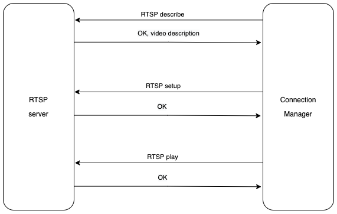
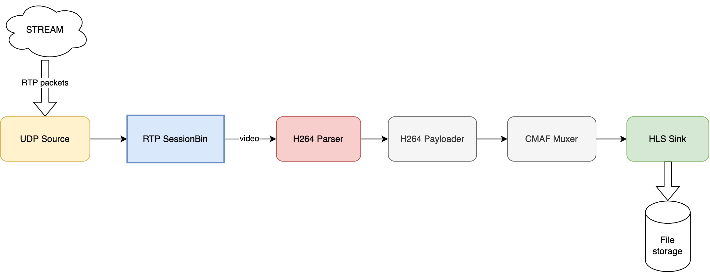

# Architecture

Now let's discuss how the architecture of our solution will look like.

The main component will be the Membrane's pipeline, which defines a sequence of tasks which we will perform on the media stream. In our case the pipeline will ingest RTP stream and convert it to HLS.

We will also use a Connection Manager, which will be responsible for establishing an RTSP connection with the server.


When initializing, the pipeline will start a Connection Manager which starts an RTSP connection with the server. Once the connection is fully established, the pipeline will be notified.

Let's take a closer look on each of those components:

## Connection Manager
The role of the connection manager is to initialize RTSP session and start playing the stream.
It communicates with the server using the [RTSP requests](https://antmedia.io/rtsp-explained-what-is-rtsp-how-it-works/#RTSP_requests). In fact, we won't need many requests to start playing the stream - take a look at the desired message flow:



First we want to get the details of the video we will be playing, by sending the `DESCRIBE` method. 
Then we call the `SETUP` method, defining the transport protocol (RTP) and client port used for receiving the stream.
Now we can start the stream using `PLAY` method.

## Pipeline

The pipeline consists of a couple elements, each of them performing a specific media processing task.



Let us describe briefly what is the purpose of each of the components:

### UDP Source
This element is quite simple - it receives UDP packets from the network and sends their payloads to the next element.

### RTP SessionBin
RTP SessionBin is a Membrane's Bin, which is a Membrane's container used for creating reusable groups of elements. In our case the Bin handles the RTP session with the server, which has been set up by the Connection Manager.

### H264 Parser
H264 parser is quite a complex element, designed to read the incoming H264 stream. We have prepared a [separate, supplemental chapter of this tutorial](H264_codec.md) to describe the H264 codec and our parser's implementation - we invite you to read it, however, that knowledge is not necessary to successfully run the application.

### CMAF Muxer
The CMAF Muxer splits the stream into so-called segments - stream parts of the desired duration.

### HLS converter

Once data reaches the HLS bin, it needs to be put into the appropriate container files. Since we will be using Common Media Application Format (CMAF) to distribute our media, we need to put all the tracks into the `fragmented MP4` container. The first step is to payload the track's data. Payloading transforms the media encoded with a given codec into a form that is suitable to be put into the container.
The audio track is payloaded within the `Membrane.MP4.Payloader.AAC` module and the video track is payloaded with an H264 payloader, implemented by the `Membrane.MP4.Payloader.H264` module.
The payloaded streams (both the audio stream and the video stream) are then put in the result CMAF file - and the `Membrane.MP4.Muxer.CMAF` is the element responsible for that process. The name 'muxer', relates to the process
of 'muxing' - putting multiple tracks in one file, which is done by that element. Furthermore, the `CMAF muxer`, splits the streams into so-called segments - stream parts of the desired duration. Along that procedure, the manifest files, which contain metadata about the media and names of the appropriate segment file names, are generated.
Finally, the output files: '.m4s' files for each of the segments, as well as manifest files, are written on the disk.
Let's take a look at how do the generated files look like:

As we can see, there are:

- index.m3u8 - the manifest file which contains metadata about the media, as well as the URI of the manifest files for both the video and audio track.

```
#EXTM3U
#EXT-X-VERSION:7
#EXT-X-INDEPENDENT-SEGMENTS
#EXT-X-MEDIA:TYPE=AUDIO,NAME="audio_default_name",GROUP-ID="audio_default_id",AUTOSELECT=YES,DEFAULT=YES,URI="audio.m3u8"
#EXT-X-STREAM-INF:BANDWIDTH=4507734,CODECS="avc1.42e00a",AUDIO="audio_default_id"
video_g2QABXZpZGVv.m3u8
```

- audio.m3u8 - the manifest file for the audio track.

```
#EXTM3U
#EXT-X-VERSION:7
#EXT-X-TARGETDURATION:8
#EXT-X-MEDIA-SEQUENCE:0
#EXT-X-DISCONTINUITY-SEQUENCE:0
#EXT-X-MAP:URI="audio_header_g2QABWF1ZGlv_part0_.mp4"
#EXTINF:8.0,
audio_segment_9_g2QABWF1ZGlv.m4s
#EXTINF:8.0,
audio_segment_10_g2QABWF1ZGlv.m4s
#EXTINF:8.0,
audio_segment_11_g2QABWF1ZGlv.m4s
```

That file contains some metadata (like the desired duration of the segment), along with the URI pointing to the '.mp4' header file of the fMP4 container, and the list of the segment files, in '.m4s' format.
Each segment is described with `EXTINF` directive, indicating the duration of the segment, in seconds.

- video\_<identifier>.m3u8 - the manifest file for the video track. Its structure is similar to the structure of the audio.m3u8 file. However, it is worth noting, that the desired duration of each segment is equal to 10 seconds - and the '.m4s' files are holding a video stream of that length.

```
#EXTM3U
#EXT-X-VERSION:7
#EXT-X-TARGETDURATION:10
#EXT-X-MEDIA-SEQUENCE:0
#EXT-X-DISCONTINUITY-SEQUENCE:0
#EXT-X-MAP:URI="video_header_g2QABXZpZGVv_part0_.mp4"
#EXTINF:10.0,
video_segment_8_g2QABXZpZGVv.m4s
#EXTINF:10.0,
video_segment_9_g2QABXZpZGVv.m4s
```

- audio_header\_<identifier>_part\<part_ordering_number>_.mp4 - a binary file, the header meant to describe the audio track in the format required by the fragmented MP4 container.
- video_header\_<identifier>\_part\<part_ordering_number>.mp4 - a binary file, the header meant to describe the video track in the format required by the fragmented MP4 container.
- audio_segment\_\<segment_ordering_number>\_\<>.m4s - particular segments containing fragments of the audio stream.
- video_segment\_\<segment_ordering_number>\_\<>.m4s - particular segments containing fragments of the video stream.