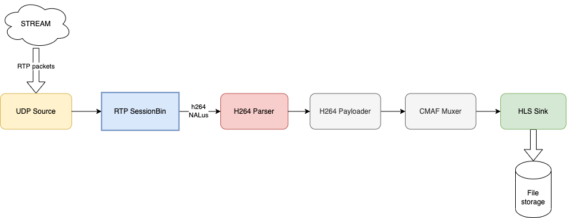

# Architecture

Now let's discuss how the architecture of our solution will look like.

The main component will be the Membrane's pipeline, which defines a sequence of tasks which we will perform on the media stream. In our case the pipeline will ingest RTP stream and convert it to HLS.

We will also use a Connection Manager, which will be responsible for establishing an RTSP connection with the server.

When initializing, the pipeline will start a Connection Manager which starts an RTSP connection with the server. Once the connection is fully established, the pipeline will be notified.

Let's take a closer look on each of those components:

## Connection Manager
The role of the connection manager is to initialize RTSP session and start playing the stream.
It communicates with the server using the [RTSP requests](https://antmedia.io/rtsp-explained-what-is-rtsp-how-it-works/#RTSP_requests). In fact, we won't need many requests to start playing the stream - take a look at the desired message flow:

First we want to get the details of the video we will be playing, by sending the `DESCRIBE` method. 
Then we call the `SETUP` method, defining the transport protocol (RTP) and client port used for receiving the stream.
Now we can start the stream using `PLAY` method.

## Pipeline

The pipeline consists of a couple elements, each of them performing an atomic media processing task.

