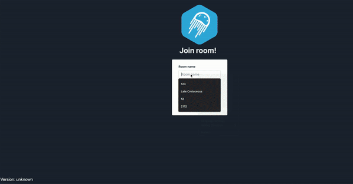

The scope of this tutorial covers the process of creating your own video room with the use of the Membrane framework.
# Introduction
It hasn't been that long ago then video rooms have become quite a common tool used in many fields of our life. We use them when we want to have an impression of meeting our beloved ones in the manner as they were sitting just next to us. We use them at work, to synchronize our work progress and exchange information between us and our colleagues. 
Taking advantage of recent technological improvements and state-of-the-art tools introduced in the field of data transmission, video streaming
has become accessible to everyone at the scale not known previously. 
But have you ever wondered how does a video room work under the hood? How is it possible for tools such as WebEx or Google Meets to be capable of streaming data between that many peers participating in the same video conversation? 
Or maybe you have thought of creating your own video room but didn't know where to start?
If so, I will be pleased to invite you to take an exciting journey to the land of the data streaming and follow this tutorial. At the end of the tutorial, you will have a fully functional video room implemented - a place, where you will be able to meet your friend and have a conversation. And by the way, you will find out about many interesting aspects of media streaming as well as you will get familiar with the use of tools which make media streaming easier.

## Expected result
Here you can see how our application should work. We want to be able to open the web application, pass the name of the room to which we want to join and our own name and then join this room. In the room, we will be seeing and hearing all of the other users who have joined the given room. 

## Prerequisites
 Since media streaming is quite a complex topic it would be great for you to know something about how the browser can fetch user's media and how the connection is made between peers etc. Since we will be using the Phoenix framework to create our application - it will be much easier for you to understand what's going on if you will be even slightly familiar with that framework. Take your time and glance over these links:
 + [How does Phoenix work?](https://hexdocs.pm/phoenix/request_lifecycle.html)
 Phoenix, while being a great tool that allows creating a complex application in a considerably easy manner, requires its user to follow a bunch of good practices and use some helpful project patterns. The most important one is the MVC (Model-View-Controller) pattern, which affects the structure of project directories. The tutorial attached there provides a great introduction to Phoenix application creation and will allow you to understand the structure of our template project.

 + [How do Phoenix sockets work and the difference between endpoint and socket/channel?](https://hexdocs.pm/phoenix/channels.html) 
 When we think about building a web application the very first thing which comes to our mind is HTTP. Surely, Phoenix allows us to send HTTP requests from the client application to the server - however, Phoenix developers have prepared for you an optional way to communicate - sockets. Sockets, in contrast to plain HTTP requests, are persistent and allow bidirectional communication, while HTTP requests are stateless and work in request -> reply mode. Want to dig deeper? Feel free to read the provided part of the official Phoenix documentation!

 + [How to access user's media from the browser?](https://www.html5rocks.com/en/tutorials/webrtc/basics/)
 Ever wondered how is it possible for the browser to access your camera or a microphone? Here you will find an answer for that and many more inquiring questions!

 + [WebRTC Connectivity (signalling, ICE etc.)](https://developer.mozilla.org/en-US/docs/Web/API/WebRTC_API/Connectivity)
 One does not simply connect and send media! First, peers need to get in touch with each other (with a little help from a publicly available server), as well as exchange some information about themselves. This short tutorial will give you an outlook on how does this process (called 'signaling') can be performed!

 + [Why do we need STUN/TURN servers?](https://www.html5rocks.com/en/tutorials/webrtc/infrastructure/)
 A peer-to-peer connection can be (and in most cases is) problematic. At the same time, it is also demanded - we don't want to have our media pass through some server (both due to the throughput limitations and privacy issues). While reading this tutorial you will find some tricks which allow you to connect your beloved peer hidden by some firewalls and NAT!

 + [WebRTC architectures](https://medium.com/securemeeting/webrtc-architecture-basics-p2p-sfu-mcu-and-hybrid-approaches-6e7d77a46a66)
 Take a quick glance there and find out what are possible architectures of WebRTC servers, when to use which architecture, and how to build a streaming solution that scales and behaves well.