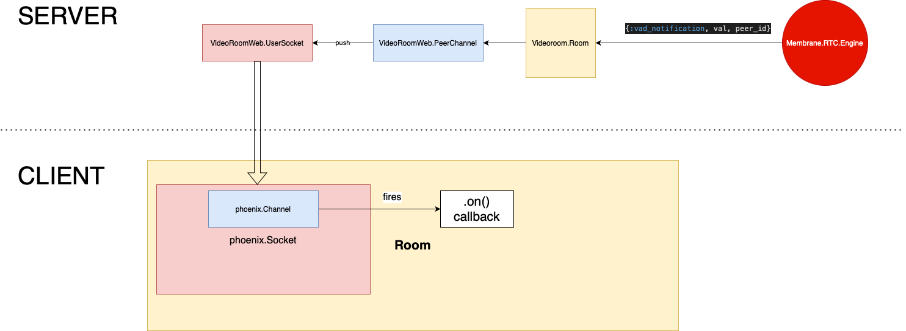

# What to do next?
  We can share with you an inspiration for a further improvements!
  ## Voice activation detection
  Wouldn't it be great to have a feature which would somehow mark a person who is currently speaking in the room? That's where voice activation detection (VAD) joins the game!
  There is a chance that you remember that SFU engine was sending some other messages which we purposely didn't handle (once again you can refer to the [documentation](https://hexdocs.pm/membrane_rtc_engine/Membrane.RTC.Engine.html#module-messages]). One of these messages sent from SFU to the client is ```{:vad_notification, val, peer_id}``` - the message which is sent once the client starts or stops speaking. We need to simply pass this message from SFU to the client's application and take some actions once it is received - for instance, you can change the user's name displayed under the video panel so that instead of plain user's name (i.e. "John") we would be seeing "<user> is speaking now" message. 
  Below you can see what is the expected result:


  

  Hopefully you will find the diagram placed below helpful as it describes the flow of the VAD notification and shows which component's of the system need to be changed:
    
  
    
    
  


  ## Muting/unmuting
  It's not necessary for each peer to hear everything...
  Why not to allow users of our videoroom to mute themselves when they want to?
  This simple feature has nothing to do with the server side of our system. Everything you need to do in order to disable the voice stream being sent can be found in (WebRTC MediaStreamTrack API documentation)[https://developer.mozilla.org/en-US/docs/Web/API/MediaStreamTrack]. You need to find a way to disable and reenable the audio track from your local media stream and then add a button which would set you in "muted" or "unmuted" state. The expected result is shown below:
  


  You can also conduct some experiments on how to disable the video track (so that the user can turn off and on camera while being in the room).
  Our suggested implementation of these two features is available at the [template repository](https://github.com/membrane_framework/membrane_videoroom_tutorial/), on `template/additional_features` branch. 

Here our journey ends! I modestly hope that you have enjoyed the tutorial and have fetched out of it that many interesting information and skills as possible. Or maybe you have even found yourself passionate about media streaming? Goodbye and have a great time playing with the tool you have just created!